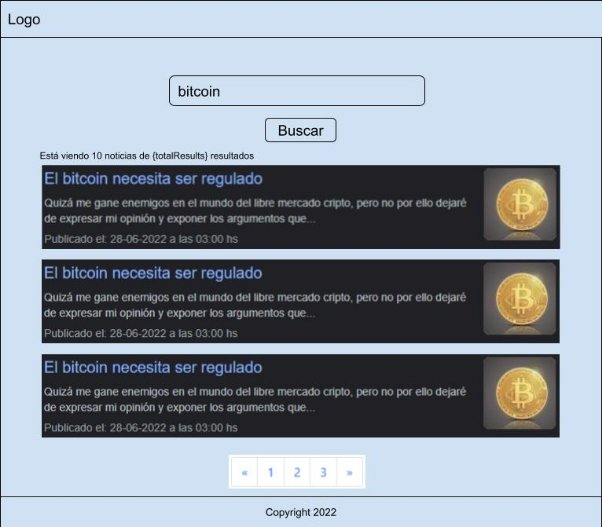

# New-app

## Screenshop 

<<<<<<< HEAD

=======

>>>>>>> 387b463145661f199d95b93d296d2d39766d2f63

## Link Demo 
[hacer click aqui para verlo](https://new-search-three.vercel.app/)

## Requisitos del Prroyecto:

Un cliente nos ha solicitado la construcción de un buscador de noticias. Para el cual se provee el siguiente mockup inicial:

Cuando el usuario realiza una búsqueda, se deben aplicar las siguientes validaciones sobre el input:

- No se debe realizar la búsqueda a menos que elusuario haya escrito almenos 3 caracteres
- El botón buscar se debe habilitar cuando el input cumpla con la condición anterior.
- [OPCIONAL], la búsqueda puede realizarse apretando la tecla enter del teclado.
- Se deberá presentar un spinner/loading para que el usuario sepa de que se está realizando un procesamiento.
- En caso de que ocurra algún fallo, se deberá presentar un mensaje adecuado, explicando el error al usuario.
- En caso de que no haya resultados, se deberá presentar un mensaje adecuado, que indique que no hay resultados para la búsqueda.
- La búsqueda sólo debe realizarse en noticias en español.

Una vez obtenida la respuesta del servicio, se deberá presentar una interfaz con los resultados obtenidos.

Por cada noticia obtenida, se debe presentar :

- El nombre de la plataforma de origen de la noticia
- El título de la noticia
- La imagen de portada de la noticia
- La fecha de publicación de la noticia en formato:dd-mm-aaaa - hh:mm hs. Ejemplo:***Publicado el: 28-06-2022 a las 03:00 hs***.(Para esto valerse de la librería Luxon Date: https://moment.github.io/luxon/#/?id=luxon).
- Cuando el usuario haga click sobre una noticia, la misma deberá de abrirse en una nueva pestaña.

El siguiente es cómo se debería de distribuir la información, el estilo, fuente y colores queda a criterio de cada uno:

El listado de noticias se debería de visualizar con el siguiente formato:

Se tienen los siguientes requerimientos:

- Sobre el listado se debe de realizar
- Mostrar la leyenda:**Está viendo 10 noticias de {totalResults}resultados**
- Paginación, donde se presenten 10 noticias por vez,
- [OPCIONAL] Se puede optar por un ‘Infinite Scroll’.
- Lo importante es que se vean 10 noticias por página.

Condiciones Generales:

- El buscador debe estar disponible ya sea en la raíz ([http://localhost) ](http://localhost)o en la ruta /buscador ([http://localhost/buscador).](http://localhost/buscador)
- En caso que el usuario ingrese en una url inválida, se debe presentar una página de 404, con el mensaje recurso no encontrado, con los estilos apropiados.
- El proyecto debe contener pruebas unitarias.
- El proyecto deberá realizarse en grupo de 2 personas como máximo.
- El proyecto se deberá subir a un repositorio en github y compartir con el tutor de la comisión a la que pertenezca.
- La aplicación debe contener un Footer y Header, acorde a los estilos escogidos.
- Los estilos, colores y fuentes quedan a criterio de las personas que integren el equipo. Las imágenes presentadas son a modo de ejemplo.
- [OPCIONAL] Uso de librerías/frameworks como mui, bootstrap, styled-components

Para poder realizar este proyecto, deberán registrarse en el sitio: https://newsapi.org/. Al obtener la apikey, tendrán disponible un endpoint, que les permitirá realizar la búsqueda de noticias.

La información de los parámetros requeridos por el endpoint lo van a poder encontrar en:[https://newsapi.org/docs/endpoints/everything.](https://newsapi.org/docs/endpoints/everything)

|**Parámetro**|**Definición**|
| - | - |
|apiKey|apikey que les permitirá hacer la búsqueda.|
|q|Es la búsqueda que realizamos. Se debe tener en cuenta las condiciones que este parámetro tiene. Esto está definido en el link anterior.|
|page|el número de página que buscamos|
|pageSize|Cantidad de Noticias por página. Por defecto en la api la cantidad es 100. Requerido por el proyecto 10.|
|language|
El idioma de las noticias. Español: es

Inglés: en
|
Ejemplo de búsqueda: [https://newsapi.org/v2/everything?**q**=bitcoin&**apiKey**=**API_KEY**&page=**1**&pageSize=**1 0](https://newsapi.org/v2/everything?q=bitcoin&apiKey=API_KEY&page=1&pageSize=10)**&language=es**

